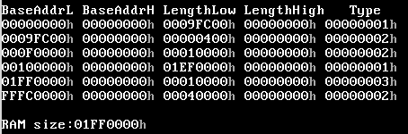

### 内存分配情况
    0000 = 64kb
    00000 = 1mb
    000000 = 16mb
    0000000 =  256mb
    00000000 = 4gb

内存检测表

内存分配图

| 起始地址 | 结束地址 | 用途 |
| :-: | :-: | - |
| 0000 0000 | 0000 0400 | bios中断向量 |
| 0000 0400 | 0000 0500 | rom bios parameter area  |
| 0000 0500 | 0000 7C00 | free  |
| 0000 7C00 | 0000 7E00 | Boot sector |
| 0000 7E00 | 0003 0000 | free |
| 0003 0000 | .... .... | 内核驻留的位置 |
| 0005 0000 | .... .... | 内核栈开始的位置 |
| 0006 0000 | 0007 0000 | GDT|
| 0007 0000 | 0008 0000 | IDT|
| 0008 0000 | 0009 0000 | 进程表 |
| 000B 8000 | .... .... | 显存 |
| 0010 0000 | .... .... | 进程空间 |

*进程表中每一项1kb大小*

*进程空间每一项64kb大小*
