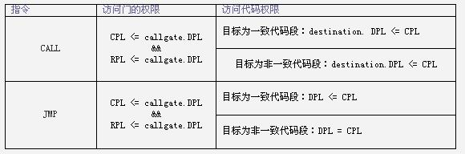

### 代码控制权转移
从一个代码段转移至另一个代码段的行为叫控制权转移.

控制权转移通常发生在以下指令执行时：
`jmp call ret iret sysenter sysexit int n`

#### 直接转移

当转移指令后直接跟目标代码段的段选择子时，称这种转移为直接转移.

- 非一致代码段之间的直接转移

此时要求CPL等于DPL，且RPL小于等于DPL

- 一致代码段之间的直接转移

要求CPL大于等于DPL,不检查RPL

#### 间接转移
间接转移一般要用到门描述符和TSS.

关于TSS
> 出于安全与系统的稳定性考虑,每个任务的不同特权级的代码执行时的堆栈是不同的也就是说在不同特权级之间的代码间转移会发生堆栈的切换.但是，调用者如何获得被调用者的堆栈段的信息呢(段选择子,偏移)?这里就牵扯了TSS(task-state
  -stack).TSS是一种用于保存一个任务的"状态"的数据结构,从里面可以获得内层代码的堆栈信息.

###### 调用门转移

调用门描述符中保存目标代码段的选择子和偏移，本身可保存在GDT和LDT中

门的访问规则类似与对数据段的访问

当对门的访问的检查通过后，cpu从门描述符中取出目标代码段的选择子，**并将目标代码段选择子的RPL清0**

- 当目标代码段是一致代码段时

此时call与jmp是等效的,此时RPL总是满足要求的(因为被清0),要求CPL(请求代码段而非门描述符的)>=DPL(目标代码段的)

转移后,CPL(cs.RPL) = DPL(请求代码段的)

**不发生特权级的改变,不切换堆栈**

- 当目标代码段是非一致代码段时

此时RPL总是满足要求的,当用call访问时，只需CPL>=RPL
当用jmp访问时，需CPL==RPL

#### 总结
可以通过call加调用门的方式访问DPL较低的非一致代码段,并发生特权级的改变
