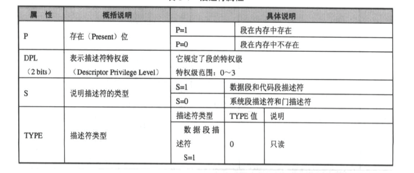
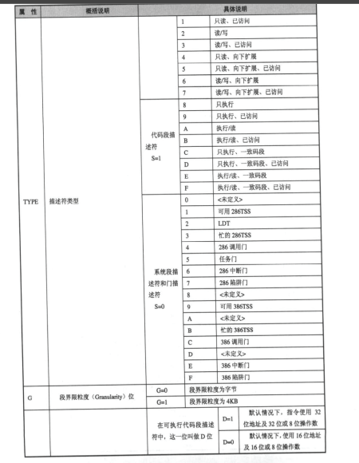
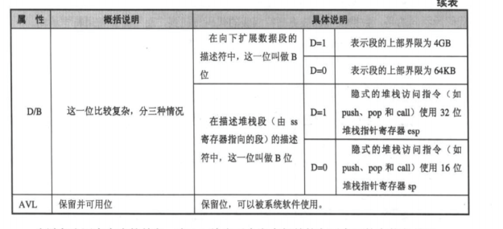

### 关于段描述符和段选择子

#### 工作原理
 cpu的工作模式分实模式和保护模式

##### 实模式
 实模式是现代CPU对*86架构的向下兼容 地址线为20位
 因此实模式下可使用的内存为 2^20 = 1 mb
 并且，cpu指令的操作数，地址等均为16位
 可使用的寄存器也为16位

 此模式下， cpu寻址方案如下：
 真正的物理地址 = cs(段地址)*16 + 偏移地址

##### 保护模式
  现代cpu真正的工作模式， 地址线为32位
  可使用内存为 2^32 = 4gb
  cpu指令的操作数，地址等为32位
  部分寄存器扩充为32位（除段寄存器外）

 此模式下， cpu寻址方案如下：
 进入保护模式之前， 建立gdt(全局描述符表)
 使用lgdt指令加载gdt的物理地址
 保护模式下， 段寄存器中存放的 不再是“段地址”
 而是段选择子， 段选择子是一个段描述符相对于gdt基地址的偏移
 和若干属性位构成。

 cpu寻址时 由段选择子找到段描述符，再从段描述符中获取基地址等信息以
 确定真正的物理地址

 #### 段描述符
 作用：描述一个段的基地址，段限长，段属性，段权限(DPL)
 具体如下：

7 | 6 ~ 5 | 4 ~ 2 | 1 ~ 0
- | - | - |
段基址2 | 段属性 | 段基址1 | 段界限1

共八个字节
其中属性字段为

7 | 6 | 5 | 4 | 3 ~ 0 | 7 | 6 ~ 5 | 4 | 3 ~ 0
- | - | - |
G | D/B | 0 | AVL | 段界限2 | p | DPL | S | TYPE

### 段描述符 中向下扩展的含义

即属性中的 E 位 不置位时
 可访问区域为 base ~ base + limit
 置位时
 可访问区域为 base + limit ~ base + 0ffffh

#### 当 D/B 位置位时 段的可访问长度由 FFFF 变为 FFFF FFFF  

#### 段选择子

15 ~ 3 | 2 | 1 ~ 0
- | - | - |
描述符索引 | TI | RPL
- TL: 段描述符存在的位置 = 1 时在ldt中
- RPL： 请求特权级
