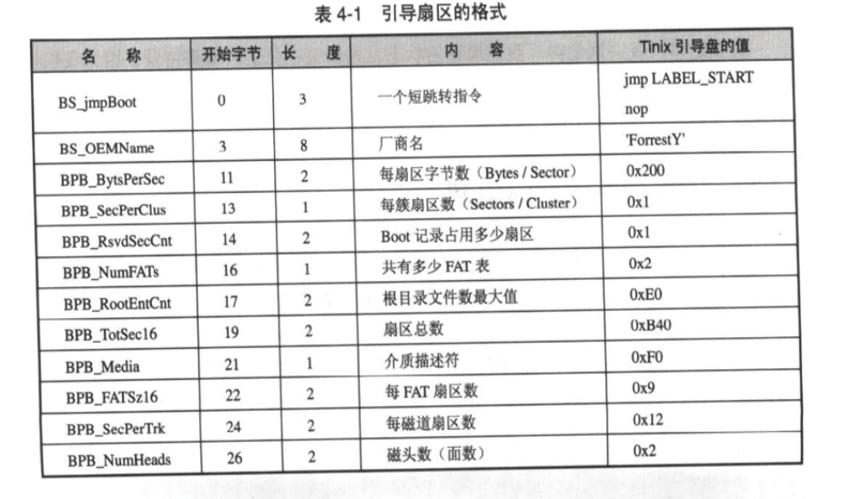
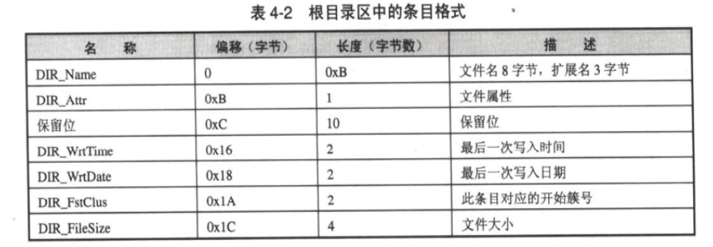
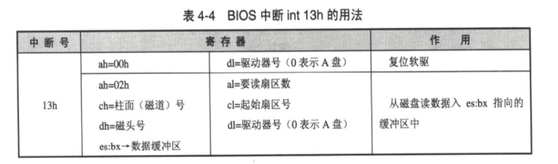
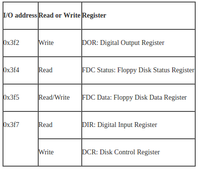

### 对fat12格式的说明
fat是file attribute table的缩写(文件分配表)，12代表每一个文件分配项所使用的位数.

#### 可引导fat12软盘
可引导fat12软盘的第一个扇区内有特殊的数据结构.

- 第0个扇区内存放数据结构和引导代码
- 紧接着存放两个相同的大小为9个扇区的fat
- 根目录区从第19个扇区开始
- 根目录区的大小不确定
- 数据区从根目录区之后开始
- 根目录区的文件和目录都是目录项

- 关于文件分配表
 - 一个文件分配表为9个扇区
 - 一个文件分配项为12位
 - 第0个和第1个fat项不使用
 - 数据区的第一个簇的fat项是2
 - fat项的内容是该文件下一个簇的序号
 - fat项的内容是ff7时，坏簇
 - fat项的内容大于等于ff8，表示文件最后一个簇

 根目录区条目格式

 

##### 实模式下读取软盘
使用bios提供的int 13h 中断
该中断用法如下

##### 保护模式下读取软盘
在保护模式下，不能使用bios中断，需要通过读写软盘控制器芯片8237来完成。

#### 在linux下创建引导盘的命令

- 先生成一个空白软盘镜像：
`dd if=/dev/zero of=data.img bs=512 count=2880`
- 使用losetup命令，把data.img作为loop device使用：`sudo losetup /dev/loop0 data.img`
- 格式化这个loop device
  `sudo mkfs.msdos /dev/loop0`
       //如果没有mkfs.msdos 命令，请检查系统是否安装了dosfstools包
- 检查文件系统：`sudo fsck.msdos /dev/loop0`
- 删除 loop device：
  `sudo losetup -d /dev/loop0`
- 这时候，data.img已经格式化完成，以可读写选项挂载空白软盘镜像
  `sudo mount -o loop,rw data.img /mnt/floop`  //确保挂载点存在
- 往软盘所挂载的节点上写入文件，容量不超过 1.44M
  `sudo cp file.c /mnt/floppy`
- 卸载软盘
  `sudo umount /mnt/floop`
- 但是这样还不可以引导，需要写一个简单的引导程序, 编译后生成 boot , 大小不能超过512Byte，然后
   `dd  bs=512 if=boot of=/dev/loop/0 count=1`
  把这个引导程序写入软盘镜像的0扇区。
